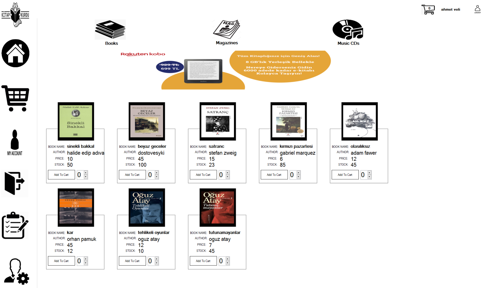
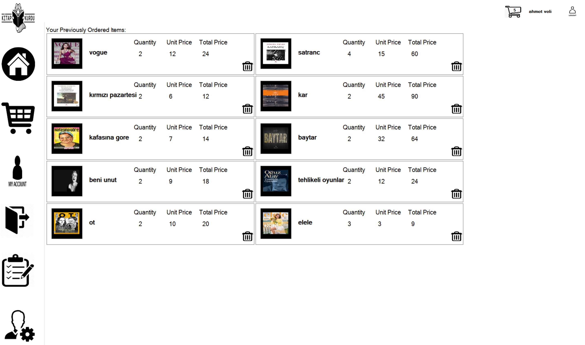
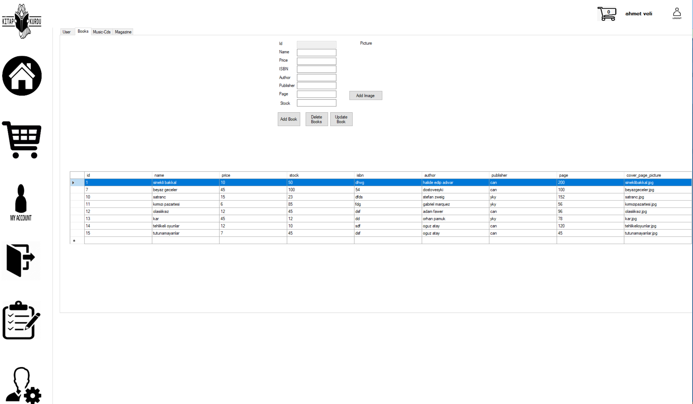
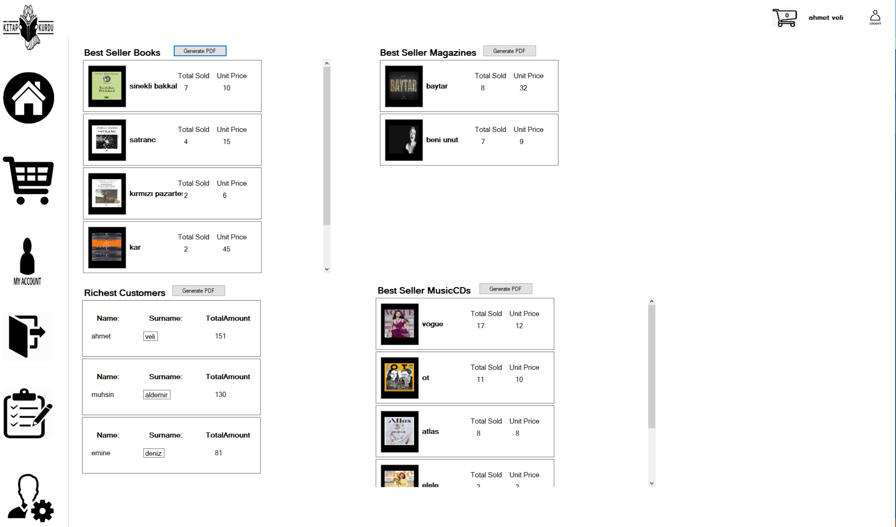
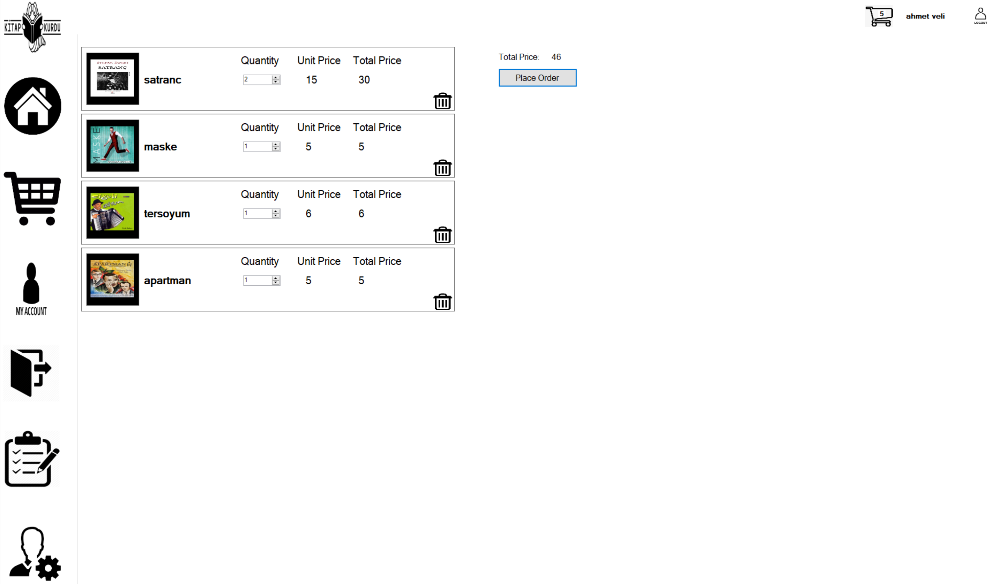

# OnlineBookShop

**Online Book Shop** is a simple software for a book store as a C# Windows Form Application.

## Prerequisites
- Change the connection string in [`DatabaseHelperClass.cs`](./onlineBookStore/DatabaseHelperClass.cs) DatabaseHelperClass.cs to apply your own.   
- iTextSharp version 5.5.13 is used to generate PDF outputs. You may need to install it on [Nuget](https://www.nuget.org/packages/iTextSharp/).

## Installation

- Microsoft SQL Server is used as a database. You can replicate the database and necessary tables/fields on your environment by executing [`database_script_schema.sql`](./docs/sql/database_script_schema.sql) file.

## Features

- User registration and login
- Product CRUD operations
- User shopping cart operations
- E-mail sending option to inform users about their purchase
- Generating PDF Reports

## Screenshots
- Homepage:

-My Account:

-Admin Panel:

-Report Screen:

-Shopping Cart:

